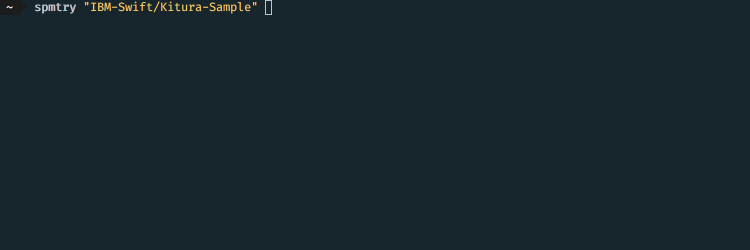

# SPMTry

Need to install a CLI tool (SPM package) for a specific project, but don't want to install it globally? Just `spmtry` it!!!

## Example
Running latest Kitura sample from `https://github.com/IBM-Swift/Kitura-Sample`:

## Getting Started
`spmtry` is an SPM package (surprise, surprise). Just clone the repo, build the project using `swift build`.
> It is recommended to add the path to executable to `$PATH`

## How it works
`spmtry` checkouts the repo, builds the project and runs the executable found in the package.

### Understanding folder structure
- `~/.spm/checkouts` - All repos will be cloned as sub directories of this root directory
- `~/.spm/bin` - Currently, each built executable is placed in subdirectories (name = commit-hash)
   of this root directory. But this may change in future once `--install` flag is added
